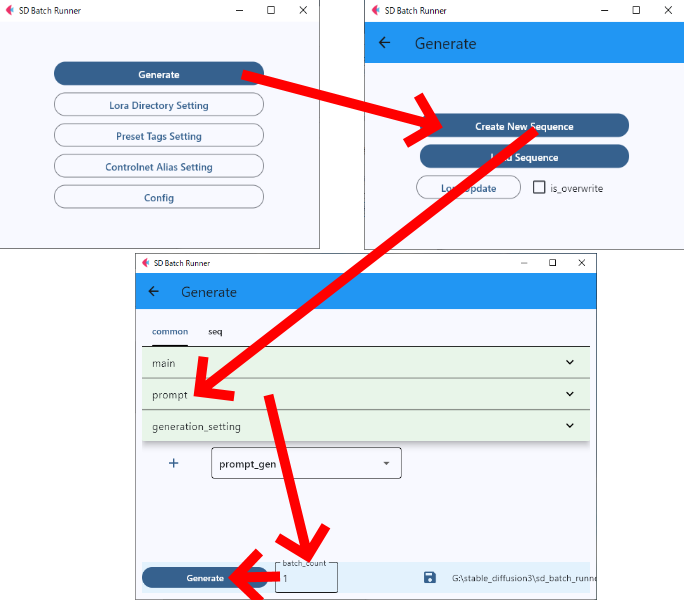

# SD Batch Runner

This is an application for batch execution of [Stable Diffusion Web UI(A1111)](https://github.com/AUTOMATIC1111/stable-diffusion-webui) launched on a local PC via api.  
(This is NOT sdwebui extension.)

It is easy to do the following.
- Image generation by simply selecting lora without manually setting trigger word or lbw  
- Batch generation of images with only the character or style changed with specific settings  
- Easy to try multiple lora combinations. (ex. Generate a combination of a specific style and all character loras)  
- Complex image generation procedures, such as those involving controlnets or consecutive txt2img,img2img, can be saved and reused at a later date.  
  (ex. After generating txt2img once, use it as an input image and execute img2img 3 times with slightly different conditions, and execute this procedure 20 times, changing the character and style each time. )  


## Installation(for windows)
[Python 3.10](https://www.python.org/) and git client must be installed  

```sh
git clone https://github.com/s9roll7/sd_batch_runner.git
cd sd_batch_runner
py -3.10 -m venv venv
venv\Scripts\activate.bat
pip install -r requirements.txt
```

## Preparation on the sdwebui side
### Installation

This is a client application using the sdwebui api, so it is necessary to launch sdwebui beforehand.
- [sdwebui](https://github.com/AUTOMATIC1111/stable-diffusion-webui) (tested with v1.10.1)  
By default sdwebui does not have api enabled!!! Please start with api enabled.
https://github.com/AUTOMATIC1111/stable-diffusion-webui/wiki/API
```sh
First, of course, is to run webui with --api commandline argument
example in your "webui-user.bat": set COMMANDLINE_ARGS=--api
```

Install the following extensions.
- Stable-Diffusion-Webui-Civitai-Helper(https://github.com/butaixianran/Stable-Diffusion-Webui-Civitai-Helper)

- adetailer(https://github.com/Bing-su/adetailer)

- sd-webui-controlnet(https://github.com/Mikubill/sd-webui-controlnet)  
It is necessary to download the controlnet model corresponding to the model you want to use.

- sd-webui-lora-block-weight(https://github.com/hako-mikan/sd-webui-lora-block-weight)  
You must set the preset. Below is an example of a preset when using pony/sdxl

```sh
Face-1:1,0,0,0,0,0,1,1,1,0,0,0
Face-2:1,0,1,0,1,0,0.8,1,1,0.6,0,1
Face-3:1,0,0,0,1,0.3,1,1,1,0.8,0,0.4
Noface:1,1,1,1,0,1,0,0,0,1,1,1
Wear:1,1,1,0,0,0,1,1,1,0,0,0
Pose:1,0,0,0,0,1,1,1,0,0,0,0
ArtStyle:1,0,0,0,0,0,0,0,0,1,1,1
Char:1,1,1,0,0,0,1,1,1,1,1,1
BG:1,1,1,1,0,1,0,0,0,1,1,1
Soft:1,0,0,0,0,0,1,1,1,1,1,1
```

- sd-webui-segment-anything(https://github.com/continue-revolution/sd-webui-segment-anything)  
You need to download one of the sam models and one of the DINO models.  
Please note that this extension has its own installation procedure. You need to set the option to use local GroundingDINO in the options settings.
```sh
Due to the overwhelming complaints about GroundingDINO installation and the lack of substitution of similar high-performance text-to-bounding-box library, 
I decide to modify the source code of GroundingDINO and push to this repository. 
Starting from v1.5.0, you can choose to use local GroundingDINO by checking Use local groundingdino to bypass C++ problem on Settings/Segment Anything. 
This change should solve all problems about ninja, pycocotools, _C and any other problems related to C++/CUDA compilation.
```

- stable-diffusion-webui-promptgen(https://github.com/davidmartinrius/stable-diffusion-webui-promptgen/tree/api-implementation)  
Please note that you need to install the branch that contains the api support(api-implementation branch), not the original created by AUTOMATIC1111.  
https://github.com/mix1009/sdwebuiapi?tab=readme-ov-file#prompt-generator-api-by-david-martin-rius  

- stable-diffusion-webui-wildcards(https://github.com/AUTOMATIC1111/stable-diffusion-webui-wildcards)  
Download the [wildcard](https://civitai.com/tag/wildcard) file you want to use.

### Organizing Lora Files
This application assumes that lora files are organized in subfolders by type.  
The following is an example. Some files may be difficult to classify, but there is no need to be so strict.  
(If there are too many files to organize, you can put only the files you want to use in a subfolder.)  

```sh
YOUR_SD_PATH/models/Lora/Pony/character
YOUR_SD_PATH/models/Lora/Pony/style
YOUR_SD_PATH/models/Lora/Pony/pose
YOUR_SD_PATH/models/Lora/Pony/item
YOUR_SD_PATH/models/Lora/Pony/etc
YOUR_SD_PATH/models/Lora/SDXL/character
YOUR_SD_PATH/models/Lora/SDXL/style
YOUR_SD_PATH/models/Lora/SDXL/pose
YOUR_SD_PATH/models/Lora/SDXL/item
YOUR_SD_PATH/models/Lora/SDXL/etc
```
Restart sdwebui when you have finished organizing the files.  
Then, use the Stable-Diffusion-Webui-Civitai-Helper you just installed to collect the lora preview image and trigger word and other information.  
(Civitai Helper Tab -> "Scan Models for Civitai" -> press "Scan" button)  


## How To Use

run sdwebui


- GUI  
run launch_GUI.bat  
(Perform [Initial Setting](#initial-settings) when starting up for the first time.)  
Go [Generate -> Create New Sequence -> common -> prompt]  
Select some lora files. By default, one character lora is selected at random.  
Go [Generate -> Create New Sequence -> common -> prompt -> preset_tags]  
Select quality tag.  
Go [Generate -> Create New Sequence -> common -> prompt -> header(or footer)]  
Enter prompt.  
Go [bottom left of app screen -> batch_count]  
For now, set about 4.  
Go [bottom left of app screen -> Generate]  




- CUI  
run launch_cmd.bat  

```sh
python main.py
```

## Initial Settings
There are a few items to be set up at first startup.  
- Lora Directory Setting  
Set the path of the directory containing lora. Multiple environments can be set up, but only one is needed at first.  
- Config -> main  
Select a stable diffusion checkpoint file.  
Select the environment name set in [Lora Directory Setting].  
- Generate -> Lora Update  
Run every time you add or remove a lora file.  


## Advanced Settings
- Controlnet Alias Setting  
Several settings are included as samples. Set the model if you want to use them.  
- Config -> lora_generate_tag  
Feature to automatically add train tags extracted from safetensors to the prompt.  
If you find the automatically added tags intrusive, please adjust them.
- Config -> lora_block_weight  
If you do not need lbw, disable it.  
It is safer to use it when combining multiple lora, as it has the effect of making the image less likely to break up.  
- Config -> adetailer  
If you want to generate even higher quality images, set [person_yolov8n] to 1 and [face_yolov8n] to 2.
- Config -> segment_anything  
Set sam model.  
Set dino model.  
( Retrieving the dino model name is not supported by the api, so you need to enter the model name by text.  
See sdwebui txt2img -> Generation -> Segment Anything -> Enable GroundingDINO -> GroundingDINO Model )  


## TODO
Create some sample sequence json files  

### Related resources
- [Stable Diffusion Web UI(A1111)](https://github.com/AUTOMATIC1111/stable-diffusion-webui)
- [sdwebuiapi](https://github.com/mix1009/sdwebuiapi)
- [Stable-Diffusion-Webui-Civitai-Helper](https://github.com/butaixianran/Stable-Diffusion-Webui-Civitai-Helper)
- [adetailer](https://github.com/Bing-su/adetailer)
- [sd-webui-controlnet](https://github.com/Mikubill/sd-webui-controlnet)
- [sd-webui-lora-block-weight](https://github.com/hako-mikan/sd-webui-lora-block-weight)
- [sd-webui-segment-anything](https://github.com/continue-revolution/sd-webui-segment-anything)
- [stable-diffusion-webui-promptgen](https://github.com/AUTOMATIC1111/stable-diffusion-webui-promptgen)
- [stable-diffusion-webui-promptgen](https://github.com/davidmartinrius/stable-diffusion-webui-promptgen/tree/api-implementation)
- [stable-diffusion-webui-wildcards](https://github.com/AUTOMATIC1111/stable-diffusion-webui-wildcards)


